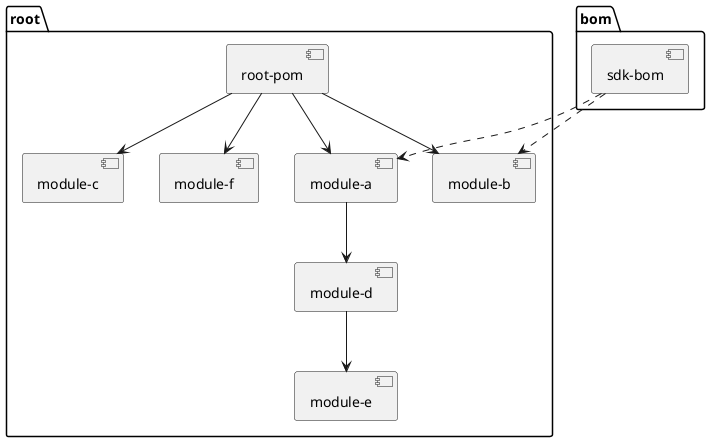

* regel toegevoegd in master
* regel toegevoegd in feature/1
* nog een regel toegevoegd in feature/1
* hotfix 4.1.1
* hotfix 5.2.1
* adsadsa

## Hotfix releasen op N-1
* Stap 1 — Maak hotfix branch vanaf release/N-1
* Stap 2 - Push hotfix branch naar BitBucket, build moet groen zijn
* Stap 3 - Maak een hotfix release aan vanuit Jenkins, gebruikt het juiste patch nummer (laatste release (N-1).2.0 -> patch tag is (N-1).2.1)

## Merge LOKAAL branch hotfix/N-1 naar release/N-1
Rebase niet gebruiken bij hotfix, de tag zit op de hotfix branch, en mag niet verloren gaan in een dead end branch.
Gebruik daarom een merge commit, zodat de geschiedenis van de hotfix branch behouden blijft.
* Stap 4 - Zorg dat je lokale branch release/N-1 up-to-date is
* Stap 5 - Checkout release/N-1 en merge hotfix/N-1 naar release/N-1. Los zo nodig merge conflicten op.
* Stap 6 - Push release/N-1 naar BitBucket. Build moet groen zijn. Release bevat nu de hotfix van N-1. Deze gaat mee in volgende minor release.

## Merge LOKAAL branch release/N-1 naar release/N
* Stap 7 - Zorg dat je lokale branch release/N up-to-date is
* Stap 8 - Checkout release/N en merge release/N-1 naar release/N. Los zo nodig merge conflicten op.
* Stap 9 - Push release/N naar BitBucket. Build moet groen zijn.

## Merge LOKAAL branch release/N naar develop
* Stap 7 - Zorg dat je lokale branch develop up-to-date is
* Stap 8 - Checkout develop en merge release/N naar develop. Los zo nodig merge conflicten op.
* Stap 9 - Push develop naar BitBucket. Build moet groen zijn. Develop bevat nu ook de hotfix van N-1, zodat deze in de volgend major mee gaat. 

## Hotfix releasen op N
* Stap 10 — Maak hotfix branch vanaf release/N. Kies de tag van de laatste minor of patch voor deze release. 
* Stap 11 - Push hotfix branch naar BitBucket, build moet groen zijn
* Stap 12 - Maak een hotfix release aan vanuit Jenkins, gebruikt het juiste patch nummer (laatste release N.2.0 -> patch tag is N.2.1)

## Merge LOKAAL branch hotfix/N-1 naar release/N-1
* Stap 13 - Zorg dat je lokale branch release/N- up-to-date is
* Stap 14 - Checkout release/N en merge hotfix/N naar release/N. Los zo nodig merge conflicten op.
* Stap 15 - Push release/N naar BitBucket. Build moet groen zijn. Release bevat nu ook de hotfix van N. Deze gaat mee in volgende minor release.
* 
## Merge LOKAAL branch release/N naar develop
* Stap 16 - Zorg dat je lokale branch develop up-to-date is
* Stap 17 - Checkout develop en merge release/N naar develop. Los zo nodig merge conflicten op.
* Stap 18 - Push develop naar BitBucket. Build moet groen zijn. Develop bevat nu ook de hotfix van N, zodat deze in de volgend major mee gaat

## Aandachtspunten

Kans op merge conflicts is groot bv op de release notes als je op beide releases hotfixes moet uitbrengen. Ook een POM kan al zijn aangepast 
op de plek waar de fix is aangebracht. Zorg dat de release notes voor beide releases volledig zijn. 

| Dependency       | Old    | New    |
| ---              | --     | ---    |
| spring-core      | 5.3.30 | 6.1.3  |
| jackson-databind | 2.15.2 | 2.17.0 |
| junit            | 4.13.2 | 5.10.2 |

De remote branches zijn niet protected. Iedereen kan vanuit zijn lokale branch pushen. Wat vinden we daarvan? Een veiliger, maar ook wat arbeidsintensiever alternatief is PR's gebruiken. 
Dat geeft veel meer controle over de code en de commit history, maar kost ook meer tijd. Zeker als er veel hotfixes moeten worden uitgebracht, kan dat een bottleneck worden.

| Dependency                                                                        | Old    | New    |
| ------                                                                            | --     | ---    |
| spring-core                                                                       | 5.3.30 | 6.1.3  |
| jackson-databind-asdasdasdasd-asdasdasd-asdasdasd-asdasd-asdasd-asdasdasd-asdasd- | 2.15.2 | 2.17.0 |
| junit                                                                             | 4.13.2 | 5.10.2 |
