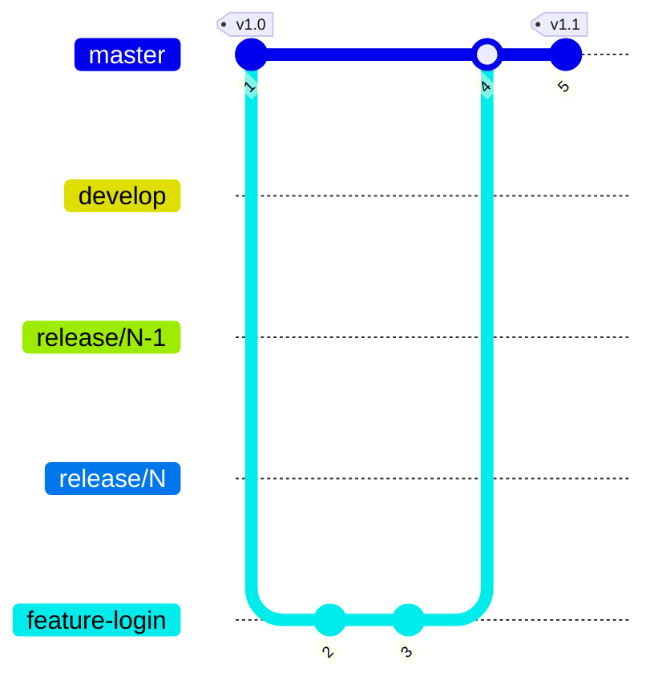

[](https://github.com/hkstwk/calculation-module/actions/workflows/calculation-module-build.yml)




```zsh
docker network create e2e-network
```

```zsh
docker run \
  --name calculation-db-e2e \
  -e MYSQL_ROOT_PASSWORD=test \
  -e MYSQL_USER=test \
  -e MYSQL_PASSWORD=test \
  -e MYSQL_DATABASE=calculation-module-db \
  -p 3306:3306 \
  --network e2e-network \
  --network-alias mysql \
  mysql:latest
```


```zsh
docker run \
    --name calculation-backend-e2e \
    -e SPRING_PROFILES_ACTIVE=e2e \
    -e SPRING_DATASOURCE_URL="jdbc:mysql://mysql:3306/calculation-module-db" \
    -e SPRING_DATASOURCE_USERNAME="test" \
    -e SPRING_DATASOURCE_PASSWORD="test" \
    -p 8080:8080 \
    --network e2e-network \
    hkstwk/calculation-backend:local
```

## Start existing e2e containers in this specific order
```zsh
docker start calculation-db-e2e 
docker start calculation-backend-e2e 
docker start calculation-frontend-e2e 
```

## Run new e2e frontend container
```zsh
docker run \
    --name calculation-frontend-e2e \
    --network e2e-network \
    -p 4200:8080 \
    calculation-frontend:e2e
```

## Stop containers
```zsh
docker stop calculation-frontend-e2e
docker stop calculation-backend-e2e
docker stop calculation-db-e2e
```

## Remove containers
```zsh
docker rm calculation-frontend-e2e
docker rm calculation-backend-e2e
docker rm calculation-db-e2e
```

## Build e2e docker image without using cache
```zsh
docker build --no-cache \
  --build-arg CONFIG=e2e \
  -t calculation-frontend:e2e .
```